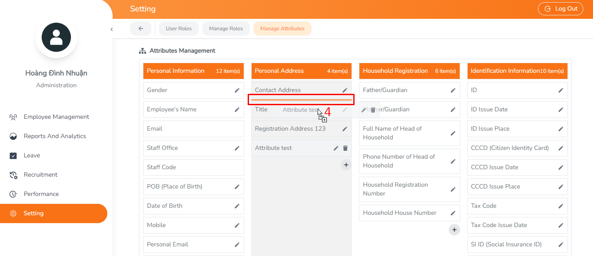
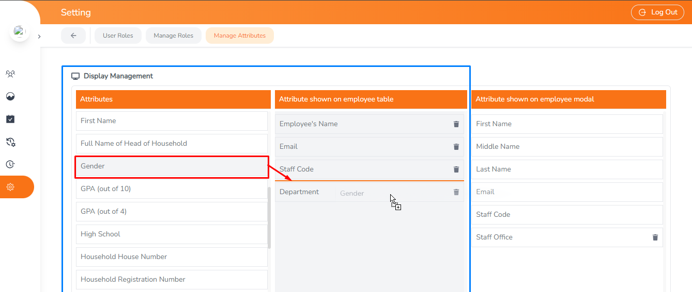
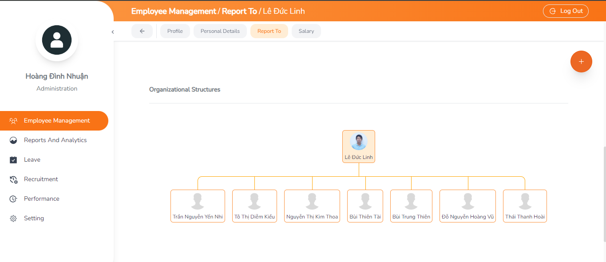
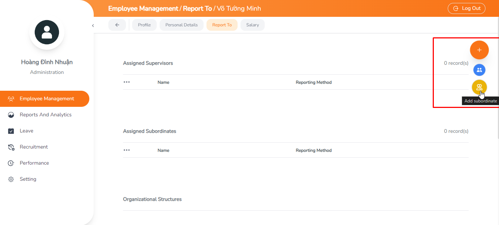
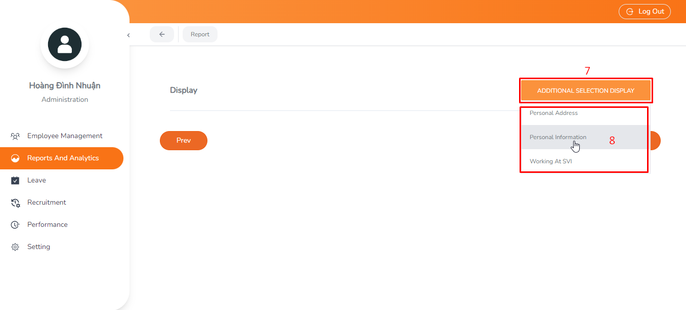

#### 1. Introduction

Welcome to the User Manual for the HRM Web-Based System. This document serves as a comprehensive guide to help you effectively utilize the features and functionalities of the HRM system. The web-based HRM system is designed to streamline human resource management processes, enhance organizational efficiency, and empower users with powerful tools for employee management, reporting, leave management, and more.

#### 2. Getting Started
Before accessing the HRM system, ensure you have the necessary login credentials provided by the HR administrator. Once logged in, you will have access to various tabs and features based on your assigned role.

##### 2.1 Login

* To access the HRM system, follow these steps:
1. Open your preferred web browser on your computer.
2. Enter the URL  [https:192.168.200.201](https:192.168.200.201) for accessing the HRM system.
3. You will be directed to the login page of the HRM system.
4. Enter your username and password in the respective fields.
    <figure class="image">
        
        <figcaption >Figure 1</figcaption>
    </figure>
5. Click on the "Login" button to proceed.
   
* Upon successful authentication, you will be logged into the HRM system and directed to your Self Profile

    <figure class="image">
        
        <figcaption >Figure 2</figcaption>
    </figure>

##### 2.2 User Interface Overview

Once logged in, take a moment to familiarize yourself with the user interface. Here's an overview of the main components:

- **Self Profile**: Your Self Profile provides comprehensive information about yourself.
  
- **Navigation Menu**: Located typically on the left of the screen, the navigation menu provides access to different modules and features of the HRM system. Commonly accessed tabs may include Employee Management, Report and Analysis, Leave Management, Performance, Recruitment, Settings.

    <figure class="image">
        
        <figcaption >Figure 3</figcaption>
    </figure>

##### 2.3 Role-based Access

- The HRM system is designed to provide role-based access,  ensuring the users only have access to  the features  ans functionalities relevant to their job responsibilities. Your assigned role will determine the tabs and features you can access within the system.
- **Admin Role**: User with administrative privileges have full  access to all features and functionalities of the HRM system. They can manage user accounts, configure system settings, and perform administrative tasks such as managing employee profiles and generating reports.
- **Supervisor Role**: Supervisors typically have access to features related to managing their team members. This may include viewing/editing employee profiles, reviewing attendance records, and managing leave requests for their team.
- **Employee role**: Regular employees have limit access within the HRM system. They  can  typically view and edit their own profile information, view leave submitted, and access certain self-service functionalities.

#### 3. Settings (Only for Master role)

  The Settings module allows administrators (Master) to configure various aspects of the HRM system, including user roles, permissions, and employee attributes. This section provides detailed information on the functionalities available within the Settings module.

##### 3.1. CRUD Roles

This functionality allows users to manage user roles, including creating, reading, updating, and deleting roles, to control access and permissions within the system.

<figure class="image">
    
    <figcaption >Figure 4</figcaption>
</figure>

**3.1.1. View Existing Roles**:
- **Description**: Users (Master role) can view a list of existing roles to understand the current role structure within the system.
- **Steps** :
    :one:. Navigate to the Setting module.
    :two:. Click on the "Manage Roles" tab.
        <figure class="image">
            
            <figcaption >Figure 5</figcaption>
        </figure>

**3.1.2. Add a new role**
- **Description**: Users can add a new role by specifying the role name, role type, and selecting the appropriate permissions.
- **Steps**:
:one: Navigate to the Setting module.
:two: Click on the "Manage Roles" tab.
:three: Click on the "+" button to create a new role.
:four: Enter the role name, role type, and select the appropriate permissions.
:five: Click "Save" to create the new role.

   <figure class="image">
        
        <figcaption >Figure 6</figcaption>
    </figure>
    <figure class="image">
        
        <figcaption >Figure 7</figcaption>
    </figure>

**3.1.4. Update role**
- **Description**: Users can update a role by selecting the desired role from the list, making necessary changes, and clicking on the "Save" button to apply the updates.

- **Steps**:
:one:. Navigate to the Setting module.
:two:. Click on the "Manage Roles" tab.
:three:. Select the desired role from the list.
:four:. Click on the "Edit" button.
:five:. Make necessary changes to the role details.
:six:. Click on the "Save" button to update the role.
    <figure class="image">
        
        <figcaption >Figure 8</figcaption>
    </figure>

    <figure class="image">
        
        <figcaption >Figure 9</figcaption>
    </figure>

**3.1.3. Delete role**
- **Description**: Users can delete a role by selecting the desired role from the list and clicking on the "Delete" button. A confirmation prompt ensures the action is intentional.

- **Steps**:
:one:. Navigate to the Setting module.
:two:. Click on the "Manage Roles" tab.
:three:. Select the desired role from the list.
:four:. Click on the "Delete" button.
:five:. Confirm the deletion when prompted.
    <figure class="image">
        
        <figcaption >Figure 10</figcaption>
    </figure>

    <figure class="image">
        
        <figcaption >Figure 11</figcaption>
    </figure>

    

##### 3.2. Assign roles

- **Description**: Assign specific roles to individual employees based on their job responsibilities and access requirements.

* **Steps**:
:one: Navigate to the Setting module.
:two: Click on the "User Roles" tab.
:three:. Select the desired employee from the list.
:four:. Click on the "Edit" button.
:five:. Make necessary changes to the user role.
:six:. Click on the "Save" button to update the role.

    <figure class="image">
        
        <figcaption >Figure 12</figcaption>
    </figure>

    <figure class="image">
        
        <figcaption >Figure 14</figcaption>
    </figure>

    <figure class="image">
        
        <figcaption >Figure 15</figcaption>
    </figure>

##### 3.3 Manage Employee Attributes

This module used to manage attribute groups and employee information attributes, including creation, reading, updating, and deletion. Attribute groups organize employee information attributes, facilitating effective data management.

**3.3.1. Group Management**
Group management allows users to organize employee information attributes into logical categories for efficient data management. This feature enables the creation, viewing, updating, and deletion of attribute groups, ensuring that employee data is organized and easily accessible.
**3.3.1.1. Add New Group**
- **Description**:
- **Steps**:
:one: Navigate to the Setting module.
:two: Click on the "Manage Attributes" tab.
:three: Click on the "+" button to create a new group.
:four: Enter the group name, description and select visible on page.
:five: Click "Save" to create the new group.

<figure class="image">
    
    <figcaption >Figure 16</figcaption>
</figure>
<figure class="image">
    
    <figcaption >Figure 17</figcaption>
</figure>

**3.3.1.2. Update Group**
- **Description**:
- **Steps**:
:one:. Navigate to the Setting module.
:two:. Click on the "Manage Attributes" tab.
:three:. Select the desired group from the list.
:four:. Click on the "Edit" button.
:five:. Make necessary changes to the group details.
:six:. Click on the "Save" button to update the group.

<figure class="image">
    
    <figcaption >Figure 18</figcaption>
</figure>

<figure class="image">
    
    <figcaption >Figure 19</figcaption>
</figure>

**3.3.1.3. Delete Group**
- **Description**:
- **Steps**:
:one:. Navigate to the Setting module.
:two:. Click on the "Manage Attributes" tab.
:three:. Select the desired group from the list.
:four:. Click on the "Delete" button.
:five:. Confirm the deletion when prompted.
:six:. Click on the "Save" button to delete the group.

<figure class="image">
    
    <figcaption >Figure 20</figcaption>
</figure>

<figure class="image">
    
    <figcaption >Figure 21</figcaption>
</figure>

**3.3.1.4. Arrange Group Order**
- **Description**: Arrange the order of attribute groups to control their display sequence in employee details.
- **Steps**:
:one:. Navigate to the Setting module.
:two:. Click on the "Manage Attributes" tab.
:three:. Drag and drop the group to reorder them according to your preference.
          
<figure class="image">
    
    <figcaption >Figure 22</figcaption>
</figure>

<figure class="image">
    
    <figcaption >Figure 23</figcaption>
</figure>

> :warning: when deleting a group, that group's attributes will be moved to the archive group.

**3.3.2. Attribute Management**
 Attribute management facilitates the creation, modification, and deletion of specific employee information attributes. This functionality enables users to define the types of data collected for each employee, ensuring comprehensive and accurate records. With attribute management, users can customize the attributes to suit their organization's needs, ensuring flexibility and efficiency in managing employee data.

**3.3.2.1. Add New Attribute**
- **Description**:
- **Steps**:
:one:. Navigate to the Setting module.
:two:. Click on the "Manage Attributes" tab.
:three:. Select the desired group from the list.
:four:. Click on the "+" button to create a new attribute.
:five:. Specify the details for the new attribute, such as name, type, and required.
:six:. Click "Save" to create the new attribute for group desired.

<figure class="image">
    
    <figcaption >Figure 22</figcaption>
</figure>

<figure class="image">
    
    <figcaption >Figure 23</figcaption>
</figure>

**3.3.2.2. Update Attribute**
- **Description**:
- **Steps**:
:one:. Navigate to the Setting module.
:two:. Click on the "Manage Attributes" tab.
:three:. Select the attribute group from the list.
:four:. Click on the "Edit" button.
:five:. Make necessary changes to the attribute details.
:six:. Click "Save" to create the new attribute for group desired.

<figure class="image">
    
    <figcaption >Figure 24</figcaption>
</figure>

<figure class="image">
    
    <figcaption >Figure 25</figcaption>
</figure>

<figure class="image">
    
    <figcaption >Figure 25</figcaption>
</figure>

**3.3.2.3. Delete Attribute**

- **Steps**:
:one:. Navigate to the Setting module.
:two:. Click on the "Manage Attributes" tab.
:three:. Select the desired attribute from the list.
:four:. Click on the "Delete" button.
:five:. Confirm the deletion when prompted.
:six:. Click on the "Save" button to delete the attribute.

<figure class="image">
    
    <figcaption >Figure 26</figcaption>
</figure>

**3.3.2.4 Arrange Attribute Order**
- **Description**: Arrange the order of attributes to control their display sequence in employee details.
  
- **Steps**:
:one:. Navigate to the Setting module.
:two:. Click on the "Manage Attributes" tab.
:three:. Drag and drop the attribute to reorder them according to your preference.

<figure class="image">
    
    <figcaption >Figure 27</figcaption>
</figure>
<figure class="image">
    
    <figcaption >Figure 28</figcaption>
</figure>
<figure class="image">
    
    <figcaption >Figure 29</figcaption>
</figure>

**3.3.3. Display Management**

Display management allows users to configure how employee information attributes are presented and organized within the system's interface. This feature enables users to customize the layout and appearance of employee profiles, ensuring that relevant information is easily accessible and visually appealing. Display management provides options for arranging attribute groups, reordering attributes within groups, and adding or removing display elements as needed. By fine-tuning the display settings, users can optimize the user experience and streamline the navigation of employee information.

**3.3.3.1 Manage Attribute Shown On Employee Table**

* **Description**: Add, delete and arrange the order of attribute in the column to control their display sequence in employee table (Employee List tab).

* **Steps**:
:one:. Navigate to the Setting module.
:two:. Click on the "Manage Attributes" tab and scroll to the "Display Management" section.
:three:. Drag and drop attribute from the "Attributes" column to the "Attribute shown on employee table" column to add or rearrange them according to your preferences.
      
 <figure class="image">
    
    <figcaption >Figure 30</figcaption>
</figure>

<figure class="image">
    
    <figcaption >Figure 30</figcaption>
</figure>

<figure class="image">
    
    <figcaption >Figure 31</figcaption>
</figure>

**3.3.3.1 Manage Attribute Shown On Employee Modal**

- **Description**: Add, delete and arrange the order of attribute in the column to control their display sequence in employee modal (Modal add a new employee).
       

* **Steps**:
:one:. Navigate to the Setting module.
:two:. Click on the "Manage Attributes" tab and scroll to the "Display Management" section.
+ Drag and drop attribute from the "Attributes" column to the "Attribute shown on employee modal" column to add or rearrange them according to your preferences.

<figure class="image">
    
    <figcaption >Figure 32</figcaption>
</figure>

<figure class="image">
    
    <figcaption >Figure 33</figcaption>
</figure>

<figure class="image">
    
    <figcaption >Figure 34</figcaption>
</figure>

    ⚠ Warning: The adjustments made above are temporarily store in the browser's memory. To apply these changes system-wide, it's essential to save them. Please ensure to scroll to the bottom of the page and click the "Save" button, or use the key combination "Ctrl + S" to save the changes.

        

### 4. Employee Management

The employee management module allows users to efficiently manage employee information, including personal details, organizational relationships and salary. This section provides detailed information on the functionalities available the Employee Management module based on different user roles.

##### 4.1. Employee List (Only for Admin/Supervisor role)

- **Description**: Access a comprehensive list of all employees in the organization.
- **Steps**: 
:one:.Navigate to the Employee Management module.
:two:.Select the "Employee List" tab.

<figure class="image">
    
    <figcaption >Figure 42</figcaption>
</figure>

##### 4.2. Add Employee (Only for Admin/Supervisor role)

- **Description**: Add new employees to the system by entering their personal and employment details.
- **Steps**: 
:one:. Navagate to the Employee Management module.
:two:. Click on the "+" button.

    <figure class="image">
        
        <figcaption >Figure 35</figcaption>
    </figure>

    :three:. Enter the required information, such first name, middle name, last name, email, staff code, etc.
    <figure class="image">
        
        <figcaption >Figure 36</figcaption>
    </figure>

  -  Receive notifications for missing employee information
    <figure class="image">
        
        <figcaption >Figure 37</figcaption>
    </figure>

  -  Recieve notifications regarding incorrectly formatted staff code (Staff code must be start with "SAV-").
      <figure class="image">
        
        <figcaption >Figure 38</figcaption>
      </figure>

  - Optionally, Upload the employee avatar.

    <figure class="image">
        
        <figcaption >Figure 39</figcaption>
    </figure>

    :four:. Click to "Save" button to  add the employee to the system.
        <figure class="image">
            
            <figcaption >Figure 40</figcaption>
        </figure>

    :five:. After successfull saving, you will be redirected to the profile page.

    <figure class="image">
    
    <figcaption >Figure 41</figcaption>
    </figure>

##### 4.3. Employee Profile
- **Description**: View detailed profiles of individual employees, including personal information, status, joined date, position, etc.
- **Steps**:
:one:. Navigate to the Employee Management
:two:. Select the desired employee from the list (click on Employee's name or Email).   

    <figure class="image">
        
        <figcaption >Figure 43</figcaption>
    </figure>

    - Access the employee's profile to view detailed information, such as personal details, status, position, joined date, etc.

    <figure class="image">
        
        <figcaption >Figure 44</figcaption>
    </figure>

##### 4.4. Employee Details
- **Description**: Access and modify employee details including personal information, address, contact details, education, and qualifications.

- **Steps**:
:one:. Navigate to the Employee Management module
:two:. Select the desired employee from the list (click on Employee's name or Email).   
  
    <figure class="image">
        
        <figcaption >Figure 45</figcaption>
    </figure>

  - Access and modify employee details including personal information, address, contact details, education and qualifications.
  
    <figure class="image">
        
        <figcaption >Figure 46</figcaption>
    </figure>

##### 4.5. Report Relationships 
- **Description**: Review Employee assignments and reporting relationships within the organization.
- **Steps**:
:one:. Navigate to the Employee Management module
:two:. Select the desired employee from the list by clicking on their Employee's name or Email.   
  
    <figure class="image">
        
        <figcaption >Figure 47</figcaption>
    </figure>

    - Review Employee assignments and reporting relationships within the organization.
    <figure class="image">
        
        <figcaption >Figure 48</figcaption>
    </figure>

    - Review the reporting relationships within the organization by viewing the organizational chart.
    <figure class="image">
        
        <figcaption >Figure 49</figcaption>
    </figure>

##### 4.5.1. Add Supervisor

- **Description**: Add new the supervisor for the current employee 
- **Steps**:
:one:. Hover over the "+" button and click on the "Add Supervisor" button.
    <figure class="image">
        
        <figcaption >Figure 50</figcaption>
    </figure>

    :two:. Choose the supervisor's name from the dropdown list.
    <figure class="image">
        
        <figcaption >Figure 51</figcaption>
    </figure>

    :three:. Select the reporting method name from the dropdown list.
    <figure class="image">
        
        <figcaption >Figure 52</figcaption>
    </figure>

    :four:.  Click on the "Save" button to add the new supervisor and receive a notification of the changes.
    <figure class="image">
        
        <figcaption >Figure 53</figcaption>
    </figure>

    > :bulb: **Tip:** To add a new reporting method to the list, you can select Other and input a new method name.

##### 4.5.1. Add Subordinate

- **Description**: Add new subordinate(membership) for the current employee
- **Steps:**
:one:. Hover over the "+" button and click on the "Add subordinate" button.
    <figure class="image">
        
        <figcaption >Figure 54</figcaption>
    </figure>

    :two:. Choose the subordinate's name from the dropdown list.
        <figure class="image">
            
            <figcaption >Figure 55</figcaption>
        </figure>

    :three:.  Select the reporting method name from the dropdown list.
            <figure class="image">
                
                <figcaption >Figure 56</figcaption>
            </figure>

    :four:.  Click on the "Save" button to add the new subordinate and recieve a notification of the changes.
            <figure class="image">
                
                <figcaption >Figure 57</figcaption>
            </figure>

    > :bulb: **Tip:** To add a new reporting method to the list, you can select Other and input a new method name.

##### 4.5.1. Add Assign Attachment
- **Description**: Add a new attachment for the report
- **Steps**:
    :one:. Click on the "Add Attachment" button.
        <figure class="image">
            
            <figcaption >Figure 58</figcaption>
        </figure>

    :two:. Click on the "Browse" button to select file from your computer device, and provide a description for the  attchment.
        <figure class="image">
            
            <figcaption >Figure 59</figcaption>
        </figure>

    > :warning: **Warning:** The attachment file size limit is 5MB. 

    :three:.  Click on the "Save" button to add the new attachment and recieve a notification of the changes.
        <figure class="image">
            
            <figcaption >Figure 60</figcaption>
        </figure>

       
##### 4.6. Employee Salary 

- **Description**: Employee salary page provides a concise overview of current salary details, including history, etc.
- **Step**:
    :one:. Navigate to the Employee Management module
    :two:. Select the desired employee from the list by clicking on their Employee's name or Email.   
    
    <figure class="image">
        
        <figcaption >Figure 61</figcaption>
    </figure>

    :three:. Select "Salary" tab to view the salary history of the  current employee.
      <figure class="image">
          
          <figcaption >Figure 62</figcaption>
      </figure> 

##### 4.6.1. Add New Salary Item
- **Description**:  Add a new the salary for the current employee.
- **Steps**:
    
    :one:. Click on the "+" button.
    :two:. Fill out the salary information in the form
    :three:. Click on the "Save" button to add the new salary information and receive a notification of the changes.
    <figure class="image">
        
        <figcaption >Figure 63</figcaption>
    </figure>

    - Review the results after adding the new salary item.
    <figure class="image">
        
        <figcaption >Figure 64</figcaption>
    </figure>

##### 4.6.2. Edit Salary Item
- **Description**: Modify existing salary information for the current employee.
- **Steps**:
    :one:. Locate the salary item you wish to edit from the list of salary history.
    :two:. Click on the salary name "Month/Year" to the salary item
    :three:. Make necessary changes to the salary information in the form.
    :four:.  Click on the "Save" button to update the salary 
        <figure class="image">
            
            <figcaption >Figure 65</figcaption>
        </figure>

    information and recieve a notification of the changes.
        <figure class="image">
            
            <figcaption >Figure 66</figcaption>
        </figure>
        
##### 4.6.3. Delete Salary Item
- **Description**: Remove a salary item from the employee's salary history.
- **Steps**:
    :one:. Locate the salary item you wish to delete from the list of salary history.
    :two:. Click on the "Delete" button next to the salary item.
      
    <figure class="image">
        
        <figcaption >Figure 67</figcaption>
    </figure>

    :three:. Confirm the deletion when prompted.
        <figure class="image">
            
            <figcaption >Figure 68</figcaption>
        </figure>

    - Receive a notification confirming the successfull deletion of the salary item.
    <figure class="image">
        
        <figcaption >Figure 69</figcaption>
    </figure>
   

### 5. Report and Analysis
The Report and Analysis module allows users to access comprehensive reports on various aspects of employee management, such as offices, genders and more. Users can customize reports to suilt their specific needs.
#### 5.1 Folders
Folders are used to store reports.

##### 5.1.1 Add New Folder

- **Description** : Add a new folder to store reports
- **Steps**:
    :one:. Navigate to the Report and Analysis module.
    :two:. Click on the "+" button.
    <figure class="image">
        
        <figcaption >Figure 70</figcaption>
    </figure>
       
    :three:. Fill out the folder name in the form
    :four:. Click on the "Save" button to add the new folder and receive a notification of the changes.

    <figure class="image">
        
        <figcaption >Figure 71</figcaption>
    </figure>

##### 5.1.2 Edit Folder

- **Description**: Modify an existing folder used to store reports.
- **Steps**:
    :one:. Navigate to the Report and Analysis module.
    :two:. Locate the folder you wish to edit and click on the "Edit" button next to it.
        
    <figure class="image">
        
        <figcaption >Figure 72</figcaption>
    </figure>

    :three:.  Update the folder information as needed.
    <figure class="image">
        
        <figcaption >Figure 73</figcaption>
    </figure>

    :four:.  Click on the "Save" button to apply the changes to the folder and receive a notification confirming the update.

##### 5.1.3 Delete Folder
- **Description**: Remove a folder from the list of folders used to store reports.
- **Steps**:
    :one:. Navigate to the Report and Analysis module.
    :two:. Identify the folder you want to delete from the list.
    :three:.  Click on the "Delete" button corresponding to the folder.

    <figure class="image">
        
        <figcaption >Figure 74</figcaption>
    </figure>

    :four:. Confirm the deletion when prompted.
        <figure class="image">
            
            <figcaption >Figure 75</figcaption>
        </figure>

    - Receive a notification confirming the successful deletion of the folder.
    <figure class="image">
        
        <figcaption >Figure 76</figcaption>
    </figure>

#### 5.2 Reports

##### 5.2.1 Add New Report

- **Description** : Create a new report with specific parameters and criteria.
- **Steps**:
    :one:. Navigate to the Report and Analysis module.
    :two:. Click on the "+" button to initiate the creation of a new report.

    <figure class="image">
        
        <figcaption >Figure 77</figcaption>
    </figure>
       
    :three:. Fill out the report name and select a folder to store the report
        <figure class="image">
            
            <figcaption >Figure 78</figcaption>
        </figure>

    :four:. Configure report filters based on desired parameters.
  
    <figure class="image">
        
        <figcaption >Figure 79</figcaption>
    </figure>

    :five:. Select attributes to be included in the report.
    <figure class="image">
        
        <figcaption >Figure 80</figcaption>
    </figure>
  
    :six:.  Choose attributes to display in the report table.

    <figure class="image">
        
        <figcaption >Figure 81</figcaption>
    </figure>

    <figure class="image">
        
        <figcaption >Figure 82</figcaption>
    </figure>

    :seven:.  Click on the "Save" button to add the new report and receive a notification confirming the changes.
    <figure class="image">
        
        <figcaption >Figure 83</figcaption>
    </figure>

    - Results 
    <figure class="image">
        
        <figcaption >Figure 84</figcaption>
    </figure>

    **5.2.1.1 Report Chart**

    <figure class="image">
        
        <figcaption >Figure 85</figcaption>
    </figure>

    <figure class="image">
        
        <figcaption >Figure 86</figcaption>
    </figure>

    <figure class="image">
        
        <figcaption >Figure 86</figcaption>
    </figure>

    

##### 5.2.2. Edit Report

- **Description**: Modify an existing report.
- **Steps**:
    :one:. Navigate to the Report and Analysis module.
    :two:. Locate the report you wish to edit and click on the "Edit" button.
        <figure class="image">
            
            <figcaption >Figure 72</figcaption>
        </figure>
    :three: Update the report information as needed.        
    :four: Click on the "Save" button to apply the changes to the report and receive a notification confirming the update.
##### 5.2.3. Delete Report
- **Description**: Remove a report from the list of reports.
- **Steps**:
    :one:. Navigate to the Report and Analysis module.
    :two:. Identify the report you want to delete from the list.
    :three:. Click on the "Delete" button corresponding to the report.

    <figure class="image">
        
        <figcaption >Figure 74</figcaption>
    </figure>

    :four:. Confirm the deletion when prompted.
    <figure class="image">
        
        <figcaption >Figure 75</figcaption>
    </figure>

    :five:. Receive a notification confirming the successful deletion of the report.
    <figure class="image">
        
        <figcaption >Figure 76</figcaption>
    </figure>

### 6. Leave Management

The Leave Management module in the HRM system allows employees  and managers to efficiency manage leave requests, time balance 

#### 6.1. My Time-Off
- **Description**: The My time-off tab provides list of time-off requests of current user.
- **Steps**: 
    :one:. Navigate to the Leave module.
    :two:. Select view type (List View/ Calendar View) from the menu.
    - List view: 
        <figure class="image">
        
        <figcaption >Figure 76</figcaption>
        </figure>

    - Calendar view: 
        <figure class="image">
        
        <figcaption >Figure 76</figcaption>
        </figure>

#### 6.2. Current Time-Off
- **Description**: The My time-off tab provides list of time-off requests of current user.
- **Steps**: 
    :one:. Navigate to the Leave module.
    :two:.  Select view type (List View/ Calendar View) from the menu.
    - List view: 
        <figure class="image">
        
        <figcaption >Figure 76</figcaption>
        </figure>

    - Calendar view: 
        <figure class="image">
        
        <figcaption >Figure 76</figcaption>
        </figure>

#### 6.3. Team Management

<figure class="image">

<figcaption >Figure 76</figcaption>
</figure>

<figure class="image">

<figcaption >Figure 76</figcaption>
</figure>
